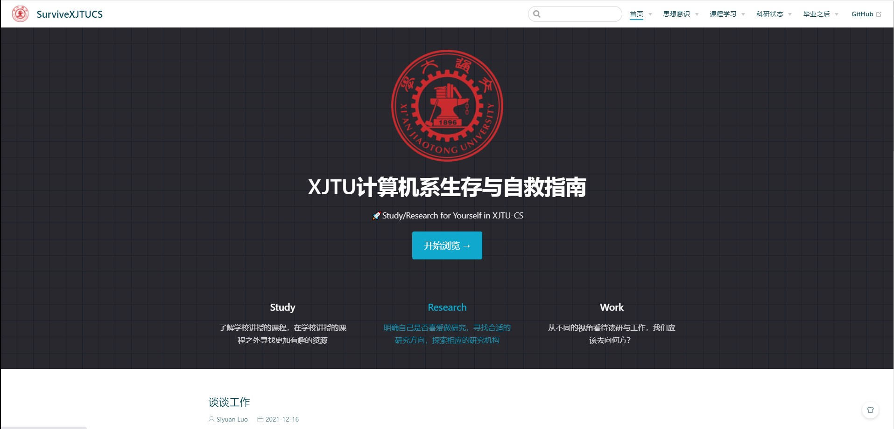
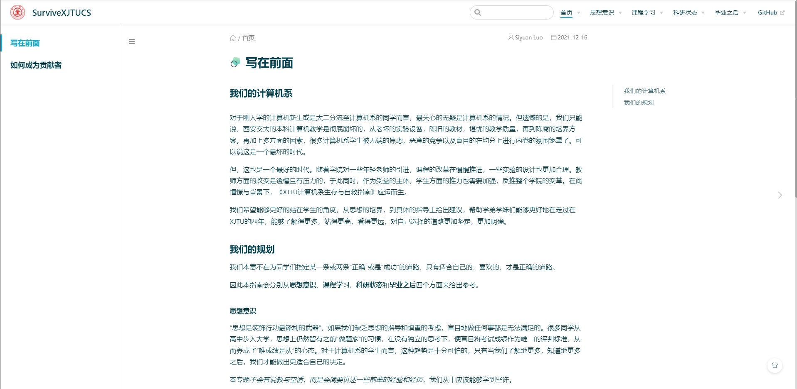
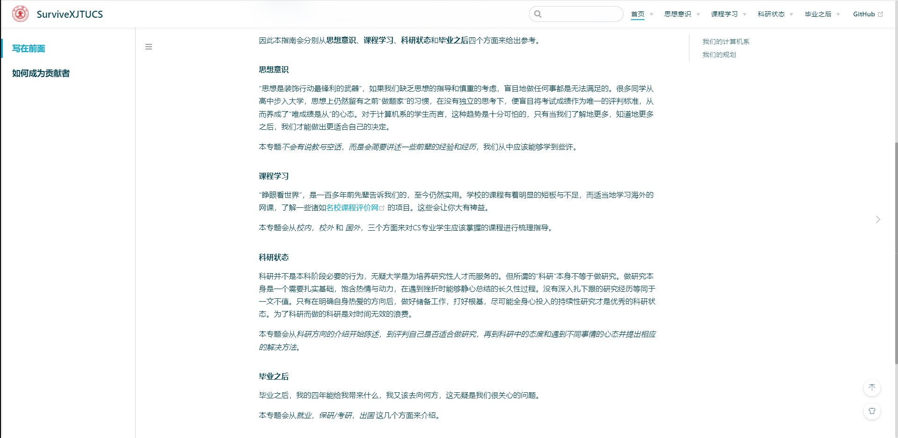

# Survive_in_XJTU_CS

**该repo为《XJTU计算机系自救与生存指南》的存储与配置仓库。**

 

 

### For User

我们已经将该项目部署到一台校内服务器中，暂未配置域名。但同学们可以在校内网络的环境下通过下面链接访问。

[《XJTU计算机系自救与生存指南》](http://115.154.246.169:8080/)

 

**注：**

这一个全新的项目，内容较为缺失，仅仅存在文档的大纲。如果您不在校园网的环境下，也可以参考下方 **For Contributor** 的内容，尝试将文档部署至本地查看。

这里仅仅有几张示例图片作为参考：

 

 

### For Contributor

🎉🎉🎉 欢迎大家向该项目提交Pull Request

配置方法见下：

> 前提：在机器上安装并配置好npm和git。

1. 将相关仓库clone到本地；

   ~~~shell
   git clone https://github.com/Survive-XJTU-CS/SurviveXJTUCS.git
   ~~~

2. 进入项目文件；

   ~~~shell
   cd SurviveXJTUCS
   ~~~

3. 安装相关依赖

   ~~~shell
   npm install
   ~~~

4. 运行

   ~~~shell
   npm run dev
   ~~~

5. 预览

> 之后便可以在浏览器中输入localhost:8080 预览项目

想要增加文档，可在docs/中修改，但请注意需要严格遵守文件夹与文档命名规范。

注:

> 添加新文档后，务必在markdown头添加标注 article: false

